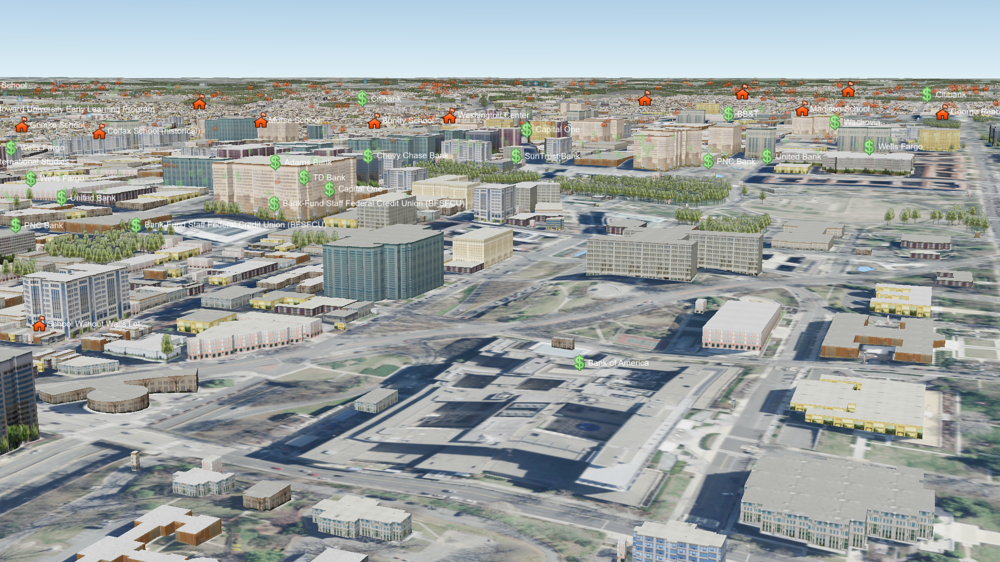

# Cesium Ion Support Added to osgEarth

<p align="center"></p>

*osgEarth rendering Cesium Ion Washington DC 3 inch imagery fused with ArcGIS base imagery, ReadyMap Elevation and OpenStreetMap MapnikVectorTile features*

[Pelican Mapping](http://web.pelicanmapping.com/) has added support for Cesium Ion to their [osgEarth](https://github.com/gwaldron/osgearth) globe rendering toolkit!

osgEarth is an extension to the [OpenSceneGraph](https://www.openscenegraph.org) scene graph library that brings the power of modern geospatial technology to OpenSceneGraph based applications.  osgEarth powers everything from basic GIS applications to high performance flight simulators and nationwide weather and traffic television broadcasts.

osgEarth supports a wide array of datasources, and now osgEarth users can now access imagery layers in their Cesium Ion account using the new [cesiumion](http://docs.osgearth.org/en/latest/references/drivers/tile/cesiumion.html) driver.

The simplest way to get started with Cesium Ion in osgEarth is to create an Earth file that references your Cesium Ion asset id and provide your API token.  It's as simple as this:

```
<map name="Cesium Ion" type="geocentric" version="2"> 
    
    <image name="cesiumion" driver="cesiumion">
        <asset_id>YOUR_ASSET_ID</asset_id>
        <token>YOUR_API_TOKEN</token>
    </image>    
    
</map>
```

You can view your Earth file using osgearth_viewer or any other osgEarth based application
```
osgearth_viewer cesiumion.earth
```

Although osgEarth currently only supports imagery layers from Cesium Ion, we hope to add support for more formats such as terrain and 3d tiles in the future!

