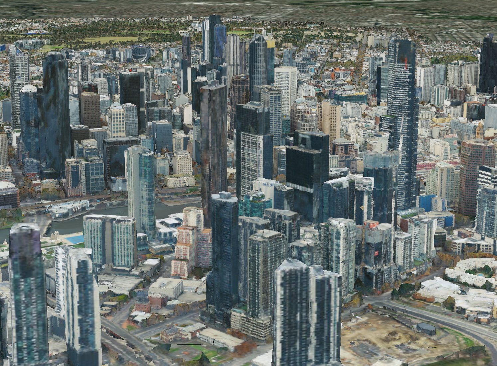

# osgEarth adds support for Cesium Ion 3D tiles and Bing Imagery

[Pelican Mapping](http://web.pelicanmapping.com/) is proud to announce support for loading 3D tiles and Bing image layers to their [osgEarth](https://github.com/gwaldron/osgearth) globe rendering toolkit.

## 3D Tiles
<p align="center"></p>

*osgEarth displaying photogrammetry of Melbourne, Australia from Cesium Ion*

We've been developing support for 3D tiles in osgEarth over the past year and it's proven to be an exciting and efficient format to work with.  We started by developing a gltf reader and writer for OpenSceneGraph based on [tinygltf](https://github.com/syoyo/tinygltf).  From there, we built a 3d tiles layer plugin for osgEarth that handles streaming tiles in.  osgEarth decides when to load and display tiles based on the same screen space error metric that Cesium uses, so 3D tiles layers should look nearly identical in osgEarth as they do in Cesium at the same viewpoint.  Once the 3d tiles loader was developed, we were able to quickly add support for Cesium Ion by adding the Ion's token based authentication to 3D tiles layer.

## Bing Maps

<p align="center"></p>

*osgEarth rendering Bing imagery with labels from Cesium Ion*

We've also added support for Bing Maps served from Cesium Ion to osgEarth.  osgEarth already has a Bing image driver, so we were able to use Cesium Ion's API to get the Bing key and map style and then create an osgEarth Bing image layer under the hood with the credentials provided by Cesium Ion.  We hope to add support for more external image types in the future.

## Putting it all together

Here is an example Earth file of how to load content from Cesium Ion in osgEarth.
```
<map name="Cesium Ion"> 

    <CesiumIonImage name="Bing Maps Aerial With Labels">
        <asset_id>3</asset_id>
    </CesiumIonImage>

    <CesiumIon3DTiles name="Melbourne">
        <asset_id>69380</asset_id>
    </CesiumIon3DTiles>

</map>
```

You can then set your Cesium Ion token as an evironment variable and then load this earth file with any osgEarth based application.
```
export OSGEARTH_CESIUMION_KEY=YOUR_API_KEY
osgearth_viewer cesiumion.earth
```

This video shows osgEarth loading nearly all of the publicly available Cesium Ion 3D tiles layer at once, check it out!
https://youtu.be/CPIoxmgiSoY


