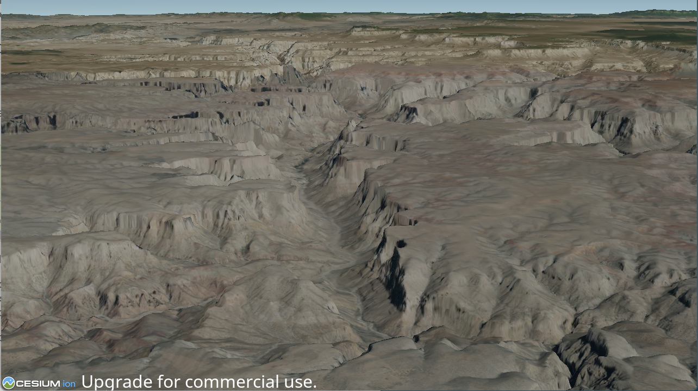
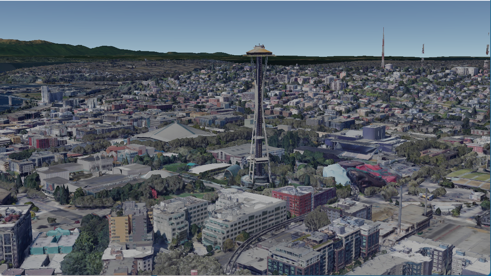

# Cesium Native Support Added to osgEarth

<p align="center"></p>

*osgEarth rendering Cesium World Terrain with a Bing Imagery overlay using Cesium Native*

[Pelican Mapping](http://web.pelicanmapping.com/) is proud to announce that we have added support for Cesium Native to [osgEarth](https://github.com/gwaldron/osgearth) as part of the [Cesium Ecosystem Grant Program](https://cesium.com/blog/2023/07/26/ecosystem-grant-recipients-summer-2023/)!

osgEarth has supported loading 3D Tiles Datasets [since 2020](https://cesium.com/blog/2020/04/02/osgearth-supports-cesium-ion-assets/) based on a completely custom implementation of both a glTF plugin and a 3D Tiles layer plugin.  The ability to visualize 3D Tiles
in osgEarth has opened the door to a whole new class of data types and being able to render high
resolution photogrammetry models and other assets from Cesium Ion has been a game changer.

Over the years the size and scope of the 3D Tiles ecosystem has grown and is progressing at an extremely rapid pace.  We were starting to find datasets that didn't load properly in osgEarth and useful extensions that we would have to do lots of work to support that we just don't have the bandwidth for.  

Based on the success of [Cesium for Unreal](https://github.com/CesiumGS/cesium-unreal) we applied for a Cesium Ecosystem Grant to add support for Cesium Native to osgEarth rather than rely on our own home grown solution to ensure that we have the same best in class 3D Tiles support as Cesium for Unreal in osgEarth and we were lucky enough to have been awarded the grant to complete this work.

By studying the code for [Cesium for Unreal](https://github.com/CesiumGS/cesium-unreal), [Cesium for Omniverse](https://github.com/CesiumGS/cesium-omniverse) and [vsgCS](https://github.com/timoore/vsgCs) we were able to design and new osgEarth NodeKit called osgEarthCesium that exposes Cesium Native to osgEarth.

Bringing the entire Cesium World Terrain draped with Bing Imagery from Cesium Ion is as simple as adding this to your earth file

```
<CesiumNative3DTiles name="Cesium World Terrain">
	<asset_id>1</asset_id>
	<raster_overlay>2</raster_overlay>
</CesiumNative3DTiles>
```

osgEarth can use Cesium Native to load datasets from Cesium Ion or any standalone 3D Tiles dataset, including [Google Earth](https://cesium.com/learn/cesiumjs-learn/cesiumjs-photorealistic-3d-tiles/).  

<p align="center"></p>
*osgEarth rendering the Seattle Space Needle from Google Earth using cesium-native*

You can view instructions on how to build osgEarth with support for cesium-native [here](https://docs.osgearth.org/en/latest/cesium_native.html).  We're excited to see what you build with osgEarth and Cesium Native!
